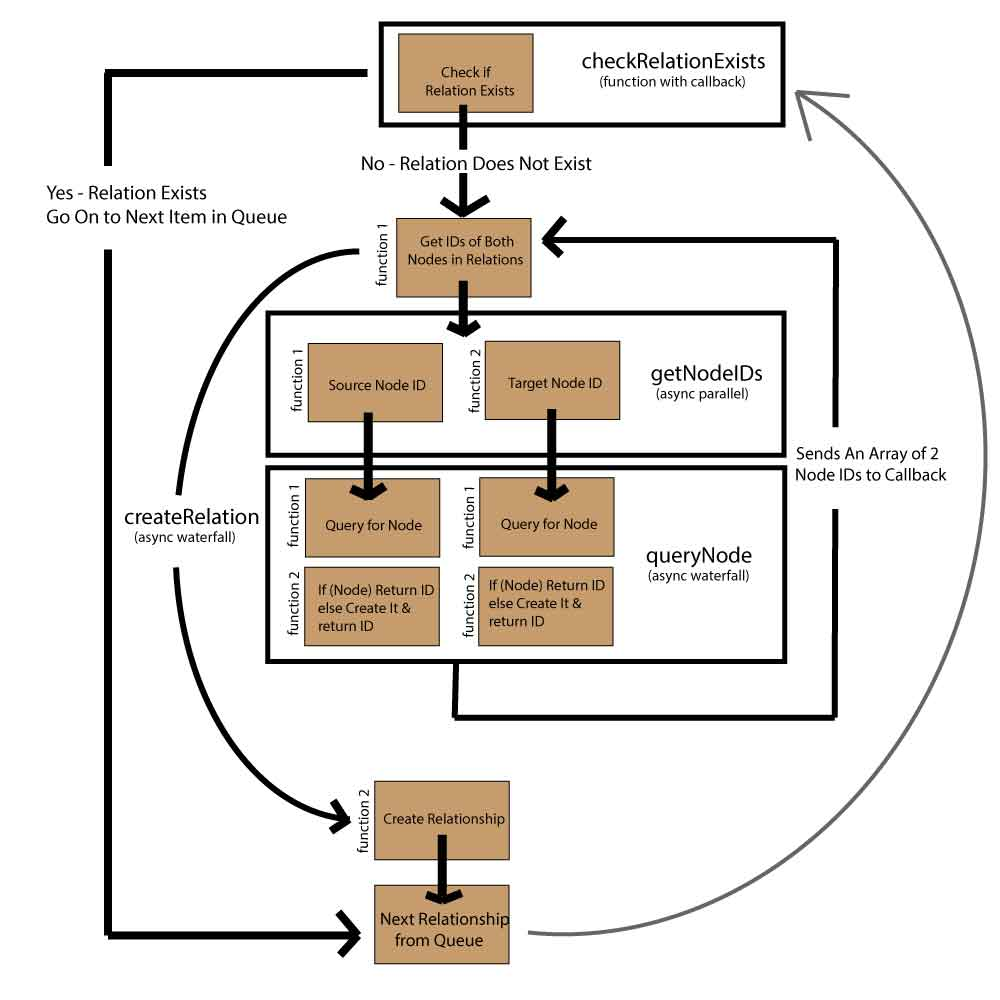

d3-neo4j
========

Example app using d3.js and data loader for Neo4j

<h4>You can see a live version of the app while it is being developed by going <a href="http://graphs.delimited.io">here</a>.

<h3>Data-loader:</h3>
The data loader will take json data containing nodes and relationships in a specified format and insert it into Neo4j. The loader and a sample data file are in the "data-loader" folder.

<h4>A Schematic of how the loader work:</h4>

